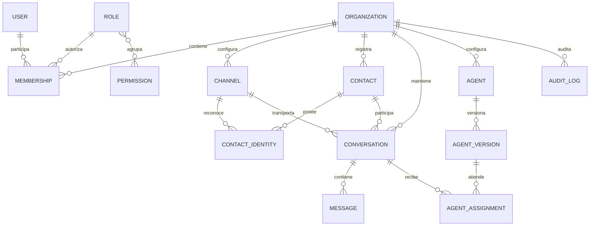

# Modelo de dominio inicial

## Propósito

Este documento define el lenguaje común y los límites conceptuales mínimos de
Agent Cloudflare. No representa todavía un esquema físico de D1 ni obliga a
usar un formato específico de identificadores.

El modelo prepara una instancia aislada por empresa para evolucionar a un
producto multiempresa. Toda entidad empresarial debe pertenecer explícitamente
a una organización, aunque el primer despliegue atienda una sola.

## Principios

- `Organization` es el límite de aislamiento, autorización y auditoría.
- Los identificadores son cadenas opacas, estables y no contienen permisos.
- Un identificador recibido del frontend nunca demuestra pertenencia.
- Los datos operativos tienen una única fuente de verdad.
- Agente, conversación y runtime son conceptos distintos.
- Estado operativo, etapa comercial y estado de cita no se intercambian.
- Los paquetes por giro extienden el núcleo mediante configuración, no forks.

## Glosario

| Concepto | Definición |
| --- | --- |
| Organización | Empresa propietaria de configuración, datos y recursos |
| Usuario | Identidad de una persona que puede acceder al panel |
| Membresía | Relación de un usuario con una organización y sus roles |
| Rol | Conjunto administrable de permisos dentro de una organización |
| Canal | Cuenta externa por la que se reciben y envían mensajes |
| Contacto | Persona atendida por una organización |
| Identidad de contacto | Identificador de un contacto en un proveedor o canal |
| Conversación | Hilo de atención entre un contacto y la organización |
| Mensaje | Registro normalizado de una entrada o salida de conversación |
| Agente | Configuración reutilizable que atiende una o más conversaciones |
| Versión de agente | Revisión inmutable y publicable de un agente |
| Asignación | Relación que determina qué agente o colaborador atiende |
| Runtime conversacional | Estado vivo usado para ordenar y coordinar una conversación |
| Auditoría | Registro de quién realizó una acción, sobre qué recurso y con qué resultado |

## Relaciones conceptuales

El diagrama expresa pertenencia y límites, no cardinalidades físicas
definitivas. Tablas de unión, índices y restricciones se decidirán en el issue
de D1.

## Límites del dominio

### Organización y acceso

- **Organization** contiene la configuración empresarial y delimita todos los
  accesos.
- **User** representa la identidad global de acceso; no concede permisos por
  sí mismo.
- **Membership** vincula usuario y organización. Una sesión solo puede operar
  en organizaciones donde exista una membresía activa.
- **Role** y **Permission** describen acciones autorizadas. La autorización se
  evalúa en backend antes de consultar datos o exponer una herramienta.

### Canales y contactos

- **Channel** identifica una cuenta del canal empresarial, su adaptador de
  transporte, modo de atención y referencias a credenciales. Para el primer
  canal, `whatsapp` describe el canal y Zernio es el adaptador bidireccional.
  Los identificadores externos son opacos y los secretos no forman parte del
  dominio persistido.
- **Contact** consolida el perfil empresarial de la persona atendida.
- **ContactIdentity** resuelve una identidad externa hacia un contacto dentro
  de la misma organización y canal.
- Una identidad externa no puede usarse para consultar datos de otra
  organización, aunque el proveedor entregue el mismo valor.

### Conversaciones y mensajes

- **Conversation** pertenece a una organización, un canal y un contacto.
- **Message** conserva la representación normalizada de una entrada o salida,
  su dirección, proveedor, identificador externo y estado de entrega.
- Los objetos de inbox, contacto o conversación de Zernio son referencias de
  transporte; no sustituyen estas entidades canónicas del producto.
- La conversación referencia el modo de atención y las asignaciones vigentes;
  su historial se registra por separado cuando sea necesario.
- El runtime no sustituye el historial consultable de conversación ni los
  mensajes persistidos.

### Agentes y asignaciones

- **Agent** es una configuración reutilizable, no una conversación ni una
  instancia de Durable Object.
- **AgentVersion** representa una revisión inmutable. Publicar una nueva
  versión no reescribe las conversaciones históricas.
- **AgentAssignment** registra qué versión atiende una conversación durante un
  periodo.
- Las herramientas disponibles dependen de organización, actor, rol y versión;
  no únicamente de las instrucciones del agente.

### Auditoría

- **AuditLog** registra actor, organización, acción, recurso, resultado,
  timestamp y `correlationId`.
- Los eventos de auditoría no deben incluir secretos ni contenido sensible
  innecesario.
- Una acción rechazada por autorización también es auditable.

## Separación de estados

Los siguientes estados responden preguntas diferentes y no deben almacenarse
en un único campo:

| Estado | Pregunta | Ejemplos |
| --- | --- | --- |
| Operativo | ¿Quién atiende y qué está ocurriendo? | nueva, IA atendiendo, humano atendiendo, pausada, resuelta |
| Comercial | ¿En qué etapa de conversión está? | servicio identificado, cita propuesta, oportunidad perdida |
| Cita | ¿Cuál es la situación de la reserva? | solicitada, confirmada, reprogramada, realizada |

Una transición operativa no mueve automáticamente el pipeline ni cambia una
cita. Las automatizaciones futuras podrán solicitar esas acciones mediante
reglas explícitas, permisos e idempotencia.

## Invariantes multiempresa

- Toda entidad empresarial incluye conceptualmente `organizationId`.
- Toda lectura y escritura verifica pertenencia en backend.
- Las búsquedas semánticas siempre filtran por organización.
- La identidad del Durable Object se deriva de
  `organizationId:conversationId`.
- Las claves de idempotencia se evalúan dentro de la organización.
- Los logs y métricas evitan datos personales completos.

## Alcance diferido

El modelo físico de D1, pipelines, citas, tareas, automatizaciones, documentos
de conocimiento y propuestas de mejora se definirá en sus fases. Esos módulos
deberán respetar los límites e invariantes establecidos aquí.
